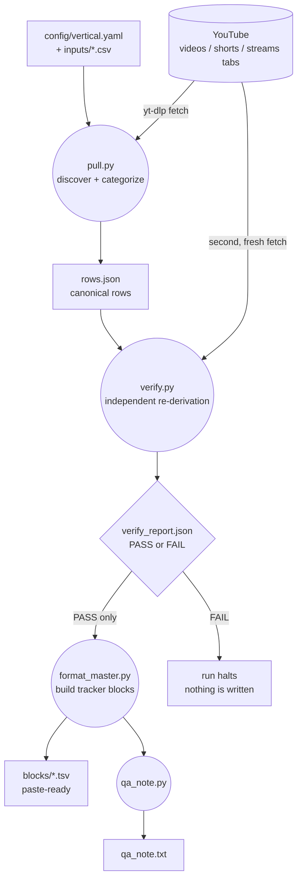

# yt-mastersheet-kit

A config-driven YouTube channel tracker. Point it at a channel, get paste-ready
master-tracker rows plus a plain-language QA note, and nothing is handed over
until a second, independently written pass of the pipeline agrees with the first.

Runs entirely on [yt-dlp](https://github.com/yt-dlp/yt-dlp): no YouTube Data API
key, no quota to manage.

## What it does

For a date range, the kit:

1. Discovers every video a channel published in that window, straight from the
   channel's own `/videos`, `/shorts`, and `/streams` tabs (never a keyword
   search, which is a lossy index of what a channel actually published).
2. Classifies each one into **Live**, **Long-form**, or **Shorts**, dates it
   correctly, and rounds its duration.
3. Independently re-derives every one of those decisions on a second code path,
   with fresh fetches, before anything downstream is allowed to run.
4. Builds tab-separated blocks in the exact column layout a shared tracker
   sheet expects, ready to paste in.
5. Writes an executive QA note: a short, plain-English list of anything a human
   should double-check on YouTube (possible misses, videos that hadn't aired
   yet, rows where no individual could be attributed).

A non-technical operator only ever touches one YAML file and a handful of CSVs
in `inputs/`. The pipeline in `src/` is config-driven and never needs editing
per channel.

## Architecture



Four phases, each its own gate, always run in this order:

| Phase | Script | Does | Refuses to continue if |
|---|---|---|---|
| 1. Pull | `src/pull.py` | Discovers + categorizes into `rows.json` | a video lands in two buckets, a row falls outside the window, a category invariant breaks, or a fetched video is neither placed nor recorded as excluded |
| 2. Verify | `src/verify.py` | Re-derives every date/duration/category on a **separate code path**, with its own fresh yt-dlp fetches, and independently re-walks the channel tabs for anything missed | never blocks the next phase itself — it just refuses to say PASS |
| 3. Format | `src/format_master.py` | Builds the paste-ready `.tsv` blocks | `verify_report.json` isn't present or doesn't say `overall: PASS` |
| 4. QA note | `src/qa_note.py` | Builds the plain-language note from what's already on disk | (reads only; nothing to gate) |

## The rules it encodes

These came out of real classification mistakes, and are enforced in code, not
just documented:

- **A livestream is dated by when it went live**, not when it was published.
  A live's publish time is often a placeholder posted hours or days earlier —
  dating by it can put a Thursday livestream on Wednesday's row.
- **Shorts and long-form are dated by publish time.**
- **A premiere is not a livestream.** YouTube's own `isLiveContent` flag
  decides, never a guess from timing.
- **Duration is always rounded up** to the next whole minute.
- **Not-yet-aired and still-airing videos are excluded and queued for a
  re-pull** — never written with a placeholder date or a 0-minute duration.
- **A video whose page fails to load is retried once**, then recorded as a
  `fetch-failed` exclusion. It is never silently dropped; every fetch loop's
  coverage is checked to balance (`requested == placed + excluded`).
- **Marathon livestreams** (configurable length, or "marathon" in the title)
  split into one row per faculty named in the title, minutes divided evenly.
  If the title names nobody, the row stays whole and is flagged for a human.
- **When no roster name can be identified in a title**, the faculty cell gets
  a configured placeholder — never blank, never a guess.
- **A second channel's livestream is only dropped as a duplicate** of a
  primary channel's row when it shares the same date *and* the same
  `Session N` number. Every drop is written to a ledger, nothing disappears
  silently.

## Quickstart

```bash
git clone https://github.com/svx2027/yt-mastersheet-kit.git
cd yt-mastersheet-kit
python3 -m venv .venv && source .venv/bin/activate
pip install -r requirements.txt

# The repo ships a fully fictional demo vertical so you can see the shape of
# a real run before pointing it at your own channel.
cp config/vertical.example.yaml config/vertical.yaml
cp inputs/faculties.example.csv inputs/faculties.csv
cp inputs/aliases.example.csv inputs/aliases.csv
cp inputs/faculty_emails.example.csv inputs/faculty_emails.csv
cp inputs/subjects.example.yaml inputs/subjects.yaml

python -m src.pull          --start 2026-07-01 --end 2026-07-07
python -m src.verify        --start 2026-07-01 --end 2026-07-07
python -m src.format_master --start 2026-07-01 --end 2026-07-07
python -m src.qa_note       --start 2026-07-01 --end 2026-07-07
```

Each phase prints its own summary and names the next command to run. Output
for the window lands in `output/2026-07-01_to_2026-07-07/`: `rows.json` (the
canonical data), an optional human-readable `.xlsx` view of the same rows,
`verify_report.json`, the paste-ready blocks under `blocks/`, and `qa_note.txt`.

To point the kit at your own channel: edit `config/vertical.yaml` (channel
handle, categorization thresholds, expected weekly cadence) and the four files
in `inputs/` (your roster, alias spellings, subject keyword rules). Nothing in
`src/` needs to change — that is the whole point of keeping config and engine
separate.

If you use [Claude Code](https://claude.com/claude-code), `.claude/commands/`
ships `/yt-setup` (a guided interview that writes your config for you) and
`/yt-mastersheet START END` (runs all four phases and pastes the result into
chat).

## Verification story

Nothing is handed over on the strength of one pass. `verify.py` deliberately
does **not** import `src/categorize.py` — it re-implements the same dating,
duration, and categorization rules from scratch, with its own IST conversion,
its own rounding, and its own fresh yt-dlp fetches. When the two independently
written implementations agree, that is real evidence the logic is right; if
`verify.py` reused `pull.py`'s functions, agreement would only prove a
function was called twice.

`verify.py` checks three things and writes `verify_report.json`:

1. **Re-derivation** — every placed video's date, duration, and category,
   recomputed from a fresh fetch, must match what `pull.py` wrote.
2. **No cross-bucket duplicates** — no video id may appear in two buckets.
3. **An independent, deeper re-walk** of every channel tab (further back than
   the pull's own lookback) confirms nothing in the window was missed.

`format_master.py` reads `verify_report.json` before doing anything else and
halts immediately if it is missing or says anything other than `PASS`. That
check is a few lines of code, not a policy someone has to remember to run.

## Tests

```bash
.venv/bin/python -m unittest discover -s tests -v
```

33 pure-function tests, no network calls. They pin the categorization rules
above — including the IST-midnight boundary, where a one-second difference in
absolute time must flip which calendar day a video is dated on — and
specifically cross-check that `pull.py`'s and `verify.py`'s independently
written categorize functions agree at that exact boundary, not just on
ordinary mid-day timestamps.

## Case study

A full write-up of the design decisions behind this pipeline is live:
[Nothing gets pasted into the tracker until two passes agree](https://shivamvashisth.com/case-studies/verify-before-deliver/),
part of a case-study series on [shivamvashisth.com](https://shivamvashisth.com).

## Honest limits

- yt-dlp only: no YouTube Data API key or quota, but that also means it is
  exposed to whatever page-structure changes YouTube makes over time.
- Dates only in Asia/Kolkata (IST) today. The timezone handling is a fixed
UTC+5:30 offset, not a general zoneinfo lookup.
- No thumbnail or vision step: marathon faculty-splitting reads the title and
  description only, and says so in the QA note when it can't resolve one.
- No web UI. It's a CLI you run by hand, from a scheduler, or from Claude Code.

## Layout

```
config/    vertical.example.yaml -- the one file that makes a run yours
inputs/    faculties / aliases / faculty_emails / subjects (*.example versions ship in the repo)
src/       the shared, channel-agnostic engine (kitconfig, ytdlp_client, categorize,
           faculty, pull, verify, format_master, qa_note)
tests/     33 pure-function tests, no network
.claude/   optional /yt-setup and /yt-mastersheet slash commands + skill, for Claude Code users
```
